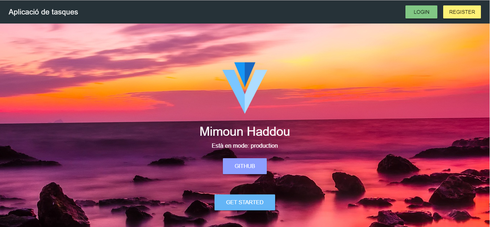

# Tasks - Aplicació tasques 

> Aplicació de tasques feta a 2DAM curs 2018-2019

[]()

- Captures de pantalla tasks


---

## Index

- [Instal·lació] (#installacio)
- [Documentació] (#documentacio)
- [Tests] (#tests)
- [Referències] (#referencies)

---

## Instal·lació

```bash
cd ~/Code
mdkir mimoun1997
cd mimoun1997/
git clone git@github.com:mimoun1997/tasks.git
cd tasks
npm install
composer install
cp .env.example .env # modificar les configuracions
php artisan key:generate
touch database/database.sqlite #Per a configuració sqlite
php artisan migrate --seed
php artisan passport:install
```


---

## Documentació

TODO

<a href="https://github.com/acacha/tasks">github acacha</a>

[Web acacha.org] (http://acacha.org/)


### Issues / Incidències
Tancar issues en commits paraules clau
````close, closes, closed, fixes, fixed #numero-issue````


---
## Tests

Per executar els testos
- php
```bash
phpunit
```
Executant phpunit en SO windows.


- javascript
```bash
cd vue
npm run test:unit
```
---

## Referències

| Laravel                                                      | Vue                                                          | Vuetify                                                      | Tailwindcss                                                  |
| ------------------------------------------------------------ | ------------------------------------------------------------ | ------------------------------------------------------------ | ------------------------------------------------------------ |
|  |  |  |  |
