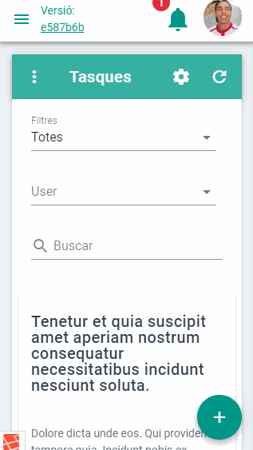
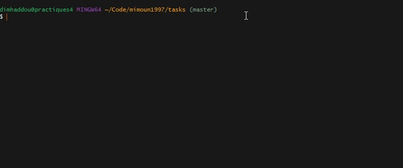

<div align="center">
    <p>
        <h1>
            <a href="https://tasks.mimoun1997.scool.cat/">
            
            </a>
            <br/>
            Tasques M97
        </h1>
        <h4>Aplicació de tasques feta a 2DAM curs 2018-2019</h4>
    </p>
    <p>
        <a href="https://tasks.mimoun1997.scool.cat/" target="_blank" rel="noopener noreferrer">
            
        </a>
        <a>
            
        </a>
        <a>
            
        </a>
        <a>
            
        </a>
    </p>
</div>


<div align="center">
    <p>
        <h2>Previsualització</h2>
        
    	
    </p>
</div>

---

## Index

- [Instal·lació] (#instal·lació)
- [Documentació] (#documentacio)
- [Tests] (#tests)
- [Referències] (#referencies)

---

## Instal·lació

```bash
cd ~/Code
mdkir mimoun1997
cd mimoun1997/
git clone git@github.com:mimoun1997/tasks.git
cd tasks
npm install
composer install
cp .env.example .env # modificar les configuracions
php artisan key:generate
touch database/database.sqlite #Per a configuració sqlite
php artisan migrate --seed
php artisan passport:install
```

---

## Documentació

TODO

<a href="https://github.com/acacha/tasks">github acacha</a>

[Web acacha.org] (http://acacha.org/)


### Issues / Incidències
Tancar issues en commits paraules clau
````close, closes, closed, fixes, fixed #numero-issue````


---
## Tests

- php
```bash
phpunit
```

<p align="center">
	
</p>

- javascript
```bash
cd vue
npm run test:unit
```
---

## Referències

| Laravel                                                      | Vue                                                          | Vuetify                                                      | Tailwindcss                                                  |
| ------------------------------------------------------------ | ------------------------------------------------------------ | ------------------------------------------------------------ | ------------------------------------------------------------ |
|  |  |  |  |


## TODO
- [x] efecte ripple: https://vuetifyjs.com/en/directives/ripples
- [x] rendiment ligthhouse
- [ ] wepb i html5 element `<picture>`
- [x] webpack -> production
- [x] minificació
- [x] CDN vs import fonts?
- [x] bg images from https://www.pexels.com/
- [ ] link compartir tasca

+ tips for performance [The Cost Of JavaScript](https://medium.com/dev-channel/the-cost-of-javascript-84009f51e99e)